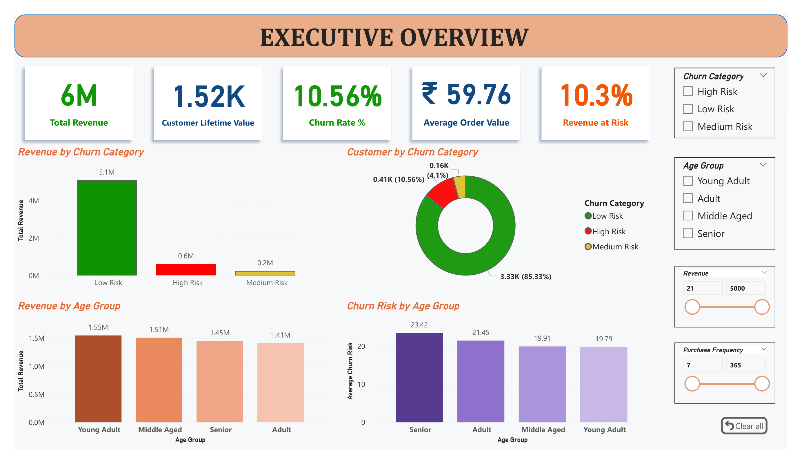
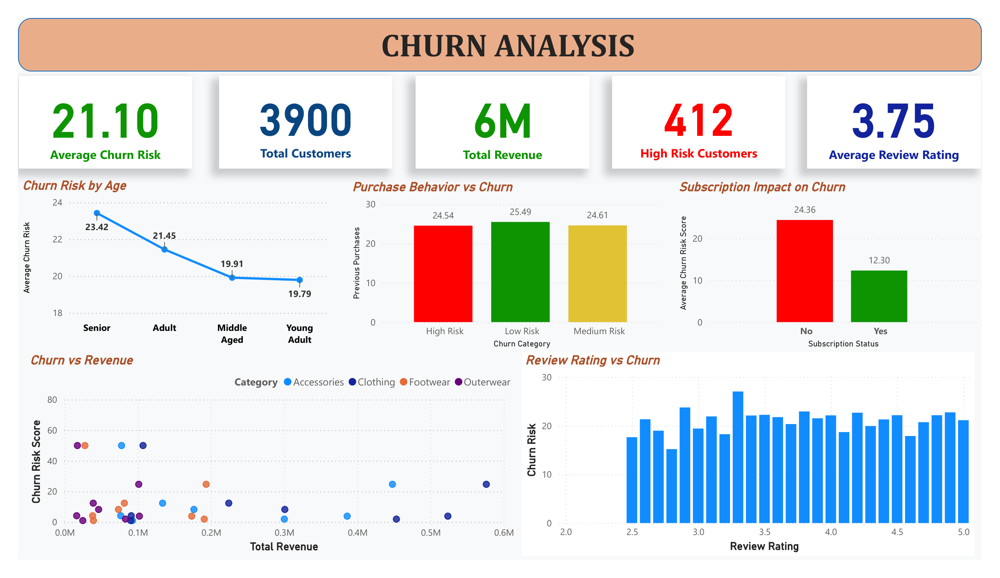
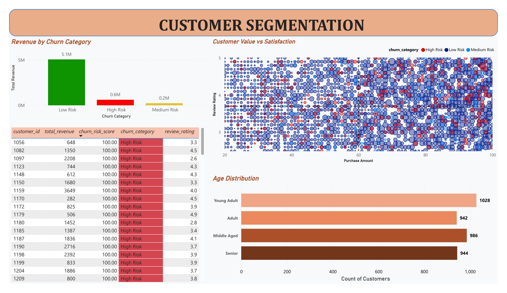

# 📊 Customer Churn Analysis & Retention Strategy

## 📌 Project Overview

This project analyzes **customer churn patterns** using **Python and Power BI** to identify high-risk customers, understand churn drivers, and provide actionable business recommendations.

The goal of this project is to help businesses improve customer retention and reduce revenue loss through **data-driven insights**.

---

## 🎯 Business Problem

Customer churn directly impacts revenue and long-term business growth.

This project focuses on:

* Identifying high-risk customers
* Understanding churn behavior
* Analyzing customer satisfaction impact
* Finding revenue at risk
* Providing retention strategies
* 🛠 Tools & Technologies Used
* Python
* Pandas
* NumPy
* Seaborn
* Matplotlib
* Jupyter Notebook
* Power BI
* DAX

---

## 📂 Dataset Information

The dataset contains:

* Customer demographics
* Purchase history
* Revenue data
* Subscription details
* Review ratings
* Churn risk scores
* Key Columns:
* customer_id
* age
* total_revenue
* purchase_amount
* previous_purchases
* review_rating
* churn_risk_score
* subscription_status

---

## 📊 Exploratory Data Analysis (EDA)

Performed:

* Churn distribution analysis
* Revenue vs churn analysis
* Customer segmentation
* Subscription impact analysis
* Behavioral pattern analysis
* Key Insights:
* Lower review ratings strongly increase churn risk
* High-value customers are also at churn risk
* Subscription users show lower churn risk
* Purchase frequency alone does not reduce churn

---

## 📈 Power BI Dashboard

The dashboard contains 4 interactive pages:

* 1️⃣ Executive Overview
Revenue KPIs
Customer distribution
Revenue by churn category
Age group analysis
* 2️⃣ Churn Analysis
Revenue vs churn risk
Review rating impact
Subscription analysis
Customer behavior patterns
* 3️⃣ Customer Segmentation
High-value customer identification
Risk-based segmentation
Customer priority analysis
* 4️⃣ Business Insights & Recommendations
Key findings
Risk indicators
Strategic recommendations
Business actions

---

## 💡 Business Recommendations

* Improve customer satisfaction programs
* Retain high-value at-risk customers
* Promote subscription plans
* Monitor churn trends continuously

## 📸 Dashboard Screenshots

* Executive Overview

* Churn Analysis

* Customer Segmentation

* Business Insights

---

## 🚀 Project Outcome

This project demonstrates:

* Data cleaning & EDA
* Business analysis
* Data visualization
* Dashboard development
* Business storytelling
* Decision-making insights

---

## 📬 Contact

Saket kumar Dubey

Aspiring Data Analyst | Python | Power BI | SQL
